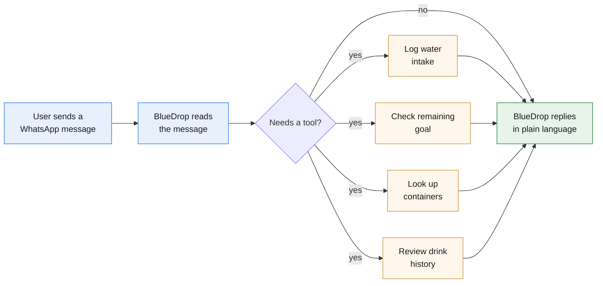
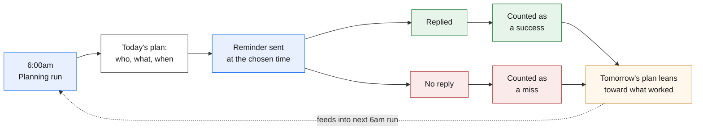

# BlueDrop
### WhatsApp Hydration Bot — Project Overview

BlueDrop is a WhatsApp bot that helps people build a daily water-drinking habit. It reaches out with personalized reminders, and lets people log their water intake or ask questions through ordinary WhatsApp conversation — no app, no menus, no commands to memorize.

---

## How it talks to users

A person can message BlueDrop on WhatsApp at any time and it responds like a person would, in plain conversation. Behind the scenes, it can:

- **Log water intake directly** — for example, "just had 500ml" is understood and recorded immediately.
- **Recognize containers by description** — if someone says "finished my bottle," it checks which containers they've saved and figures out which one they mean, asking a quick clarifying question if there's more than one reasonable match.
- **Answer progress questions** — "how much do I have left today?" or "how am I doing this week?" are answered from the person's real logged history and goal.
- **Hold a natural conversation** — anything outside those cases is still answered sensibly, rather than falling back to a canned error.

---

## How reminders are personalized

Rather than sending the same reminder to everyone at the same time, BlueDrop learns what works for each individual person.

### Six message styles

Every reminder falls into one of six categories, each with seven different phrasings so the same message doesn't repeat too often:

- **Cue** — a simple, direct nudge to drink water.
- **Habit pairing** — connects drinking water to something the person already does.
- **Log prompt** — a reminder to log water they've already had.
- **Carry reminder** — a nudge to keep water within reach.
- **System note** — a general, low-key reminder not tied to any particular habit or moment.
- **Positive association** — reinforces progress already made, to build a sense of momentum.

### Learning what works, per person

Each day, BlueDrop decides — separately for every user — which message style to send and what time of day to send it, using an approach that improves with experience (a multi-armed bandit, using Thompson sampling) rather than a fixed rule.

- If a person replies to a reminder, that combination of message style and time is recorded as a success.
- If they don't reply before the next reminder is due, it's recorded as a miss.
- Over time, BlueDrop shifts toward the styles and times that actually get a response from that specific person, instead of using a one-size-fits-all schedule.
- Some message styles also have a minimum gap between repeats (for example, a firmer "system note" won't be sent again for several days), so the mix stays varied and doesn't feel repetitive.

### Backing off for quiet users

BlueDrop also tracks how many days in a row a person has gone without replying to anything. As that streak grows, the number of reminders they receive per day is automatically reduced — down to none at all for someone who's been quiet for an extended stretch. The goal is for the bot to read as helpful, not naggy.

---

## How it runs, day to day

Two automated jobs run every day without any manual input:

- **Morning planning run (6:00am, Nigeria time)** — reviews every user, updates their quiet-streak, decides how many reminders they should get today, and picks the style and time for each one.
- **Scheduled sends (four times daily)** — at each planned time, the actual WhatsApp reminders go out, and the outcome of the previous reminder (replied or not) is scored before the next one is sent.

This whole cycle — planning, sending, and learning from the results — requires no manual intervention once it's running.

---

## Current status

This is a working prototype, currently tested with one linked account. The core loop below has been built and verified end-to-end, including a live WhatsApp message actually arriving on a real device:

| Component | Status |
|---|---|
| Conversational agent (logging, questions, clarification) | ✅ Working |
| Daily planning run (message + time selection) | ✅ Working |
| Scheduled reminder sending | ✅ Working |
| Learning from replies (success/miss scoring) | ✅ Working |
| Automatic quiet-user scaling | ✅ Working |
| Linking a WhatsApp number to an existing account | 🟧 Not yet built |
| Automatic retry on failed sends | 🟧 Not yet built |

---

## What's next

- Build the account-linking step in the conversation, so a new real user (not just the test account) can connect their WhatsApp number to their existing profile.
- Add automatic retries for message sends and other external calls, so a temporary hiccup doesn't just fail silently.
- Once there's more real usage data, revisit the fixed reminder time-of-day windows to make sure they match how people actually respond.
- Decide whether long-quiet users should occasionally get a gentle re-engagement message, rather than going fully silent.